# Astral Echo Game Loop - Infinite Tick Simulation

This diagram shows how the Astral Echo simulation works with infinite ticks, displaying the cyclical nature of the game loop.

```mermaid
graph TB
    Start([🌌 Simulation Start]) --> InitState[🎮 Initialize Game State<br/>Genesis Probe in Sol Prime]
    InitState --> TickStart{⏱️ Start Tick N}

    TickStart --> Solar[☀️ Apply Solar Charging<br/>+20 Energy to All Active Probes]
    Solar --> GetProbes[🛸 Get All Active Probes<br/>Filter out destroyed probes]
    GetProbes --> CheckProbes{Any Active Probes?}

    CheckProbes -->|No| EndSim[🔚 End Simulation<br/>All probes destroyed]
    CheckProbes -->|Yes| ProbeStatus[📊 Log Probe Status Summary<br/>Resources, Generation, Last Action]

    ProbeStatus --> ParallelAI[🤖 Run AI Agents in Parallel<br/>For Each Active Probe]

    ParallelAI --> AIDecision[🧠 AI Decision Making Process]

    subgraph "🤖 AI Agent Process (Per Probe)"
        AIDecision --> GetState[📋 Get Probe State<br/>Resources, Position, Memory]
        GetState --> GetEnv[🌍 Get Environment State<br/>Nearby Bodies, Distances]
        GetEnv --> BuildContext[🧠 Build AI Context<br/>Recent Experiences, Failures]
        BuildContext --> CallAI[🎯 Call OpenAI GPT-4<br/>Generate Strategic Plan]
        CallAI --> ExecuteActions[⚡ Execute Actions<br/>Up to 3 actions per probe]

        subgraph "🎮 Available Actions"
            ScanRes[🔍 Scan Resources]
            Travel[🚀 Travel to Body]
            Harvest[⛏️ Harvest Resources]
            Manufacture[🏭 Manufacture Probe]
            Wait[⏸️ Wait]
            Explore[🔭 Explore System]
        end

        ExecuteActions --> ScanRes
        ExecuteActions --> Travel
        ExecuteActions --> Harvest
        ExecuteActions --> Manufacture
        ExecuteActions --> Wait
        ExecuteActions --> Explore
    end

    ExecuteActions --> CollectResults[📈 Collect All Probe Results<br/>Success/Failure for each probe]
    CollectResults --> LogResults[📊 Log Tick Results<br/>Successful vs Failed probes]
    LogResults --> UpdateState[🔄 Update Game State<br/>New probe positions, resources]
    UpdateState --> SaveState[💾 Save Game State to File<br/>Persistent storage]
    SaveState --> TickDelay[⏳ Wait Tick Duration<br/>Default: 5 seconds]

    TickDelay --> TickStart

    %% Styling
    classDef startEnd fill:#e1f5fe,stroke:#01579b,stroke-width:3px,color:#01579b
    classDef process fill:#f3e5f5,stroke:#4a148c,stroke-width:2px,color:#4a148c
    classDef decision fill:#fff3e0,stroke:#e65100,stroke-width:2px,color:#e65100
    classDef ai fill:#e8f5e8,stroke:#1b5e20,stroke-width:2px,color:#1b5e20
    classDef action fill:#fce4ec,stroke:#880e4f,stroke-width:2px,color:#880e4f

    class Start,EndSim startEnd
    class Solar,GetProbes,ProbeStatus,ParallelAI,CollectResults,LogResults,UpdateState,SaveState,TickDelay process
    class TickStart,CheckProbes decision
    class AIDecision,GetState,GetEnv,BuildContext,CallAI,ExecuteActions ai
    class ScanRes,Travel,Harvest,Manufacture,Wait,Explore action
```

## Key Features of the Game Loop:

### 🔄 **Infinite Tick Cycle**

- Each tick represents one simulation step
- Continues indefinitely until all probes are destroyed
- Configurable tick duration (default: 5 seconds)

### ☀️ **Solar Energy System**

- All active probes gain +20 energy per tick automatically
- Provides steady passive income for survival
- Supplements active resource harvesting

### 🤖 **Parallel AI Processing**

- All probes make decisions simultaneously
- Each probe runs its own AI agent independently
- Up to 3 actions per probe per tick

### 🧠 **AI Decision Making**

- Uses OpenAI GPT-4 for strategic planning
- Considers probe state, environment, and memory
- Learns from past failures and experiences
- Balances survival, expansion, exploration, and resource gathering

### 🎮 **Action Types**

- **Scan Resources**: Discover what's available on celestial bodies
- **Travel**: Move between planets/asteroids (costs energy)
- **Harvest**: Extract resources from nearby bodies
- **Manufacture**: Create new probes (expensive but enables expansion)
- **Wait**: Do nothing (still gains solar energy)
- **Explore**: General system exploration

### 💾 **Persistent State**

- Game state saved to file after each tick
- Probes remember experiences across ticks
- Generational knowledge passed to offspring

### 📊 **Comprehensive Logging**

- Real-time status updates for all probes
- Success/failure tracking for each action
- Resource levels and strategic decisions
- Performance metrics and timing

The simulation creates an emergent ecosystem where probes must balance immediate survival needs with long-term expansion goals, leading to complex strategic behaviors as the probe population grows and spreads across the galaxy.
